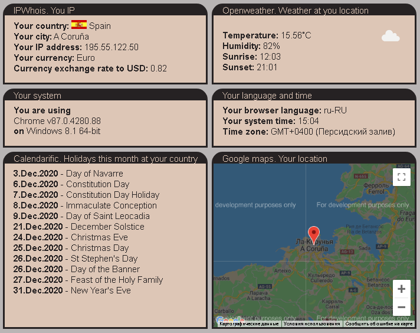
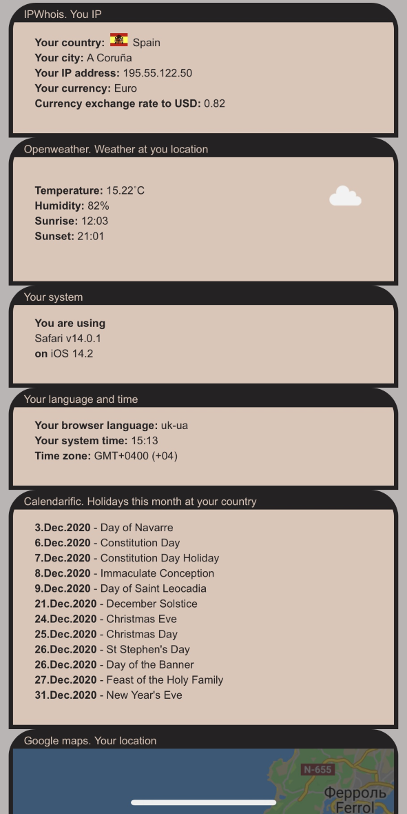

# WebAPI

### Used these cool features and APIs:
- [IPWHois](https://ipwhois.io/ "IPWhois")
- [Open Weather](https://openweathermap.org/api "Open Weather")
- [Google Maps](https://developers.google.com/maps/documentation/javascript/overview "Google Maps")
- [Calendarific](https://calendarific.com/ "Calendarific")
- [Platform](https://cdnjs.com/libraries/platform "Platform")
- and system variables
     
Pulled data using [jQuery](https://jquery.com/ "jQuery") and [Ajax requests](https://api.jquery.com/jquery.ajax/ "Ajax requests")      
Saved API keys into [.env](https://www.npmjs.com/package/dotenv "dot env package") file
### Desktop:   
     
     
### Mobile:   
 

      
### Test it yourself
Live version can be found [here](http://artem-soroka.tk/pages/api/ "API").   
     
Thank you.